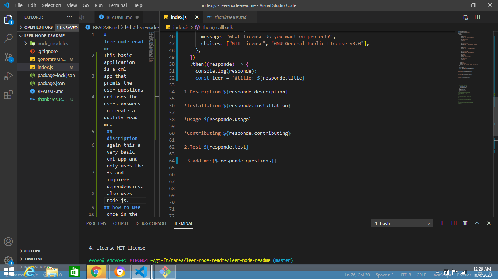

# leer-node-readme

assignment was given by the Georgia Tech Coding BootCamp.
This basic application is a cml
app that promts the user questions
and uses the users answers to create a quality read me.

## discription

again this a very basic cml app and only uses the
fs and inquirer dependencies.
also uses node js.

## how to use

once in the terminal run node index.js answer the question prompt and boom you have a quality read me

[this the link to the video](https://drive.google.com/file/d/1q5OF386jXKVgCVeaQj_ud-rrwXCluCeX/view)
